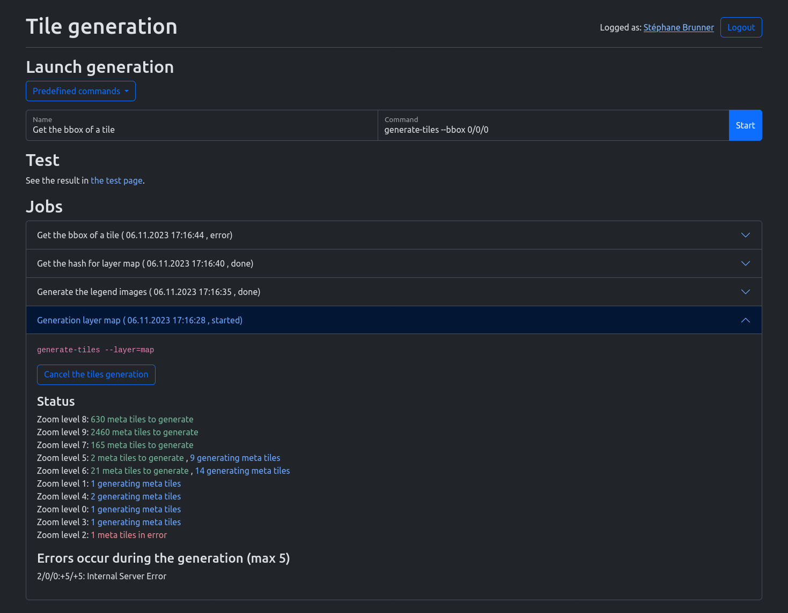

# TileCloud-chain

TileCloud Chain is a comprehensive toolset for managing tile generation workflows. It supports various source and destination formats, making it a versatile solution for map tile management.

## Sources

- Web Map Service (WMS)
- Mapnik rendering engine

## Destination Formats and Storage

- Web Map Tile Service (WMTS) layout
- Amazon S3 storage
- Azure Blob storage
- Local filesystem

## Key Features

- Tile generation with configurable parameters
- Automatic removal of empty tiles
- Geographic filtering (bbox and geometry-based)
- MetaTile support for efficient generation
- Legend image generation
- GetCapabilities document
- OpenLayers demo page
- Empty tile detection via hashing
- Cache synchronization
- Post-processing capabilities

## Legacy Support

Note: The following features are maintained for backward compatibility:

- Berkeley DB integration
- SQLite (MBTiles) support
- Mapnik rendering (Python 3 update pending)

## Visual Preview

The admin interface with PostgreSQL queue integration:



## Getting Started

Create a configuration file at `tilegeneration/config.yaml`.

Reference the [example configuration](https://github.com/camptocamp/tilecloud-chain/blob/master/example/tilegeneration/config.yaml).

## Support Policy

Only the latest release receives active support. Versions prior to 1.11 contain security vulnerabilities and should not be used.

## Development

### Building

```bash
make build
```

### Quality Assurance

```bash
make prospector
```

### Testing

```bash
make tests
```

## Documentation

- [Usage Guide](https://github.com/camptocamp/tilecloud-chain/blob/master/tilecloud_chain/USAGE.rst)
- [Configuration Reference](https://github.com/camptocamp/tilecloud-chain/blob/master/tilecloud_chain/CONFIG.md)

## Contributing

Set up pre-commit hooks:

```bash
pip install pre-commit
pre-commit install --allow-missing-config
```
