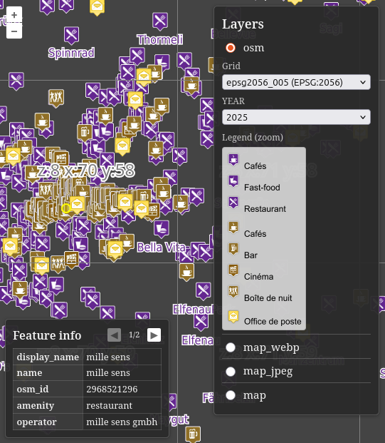
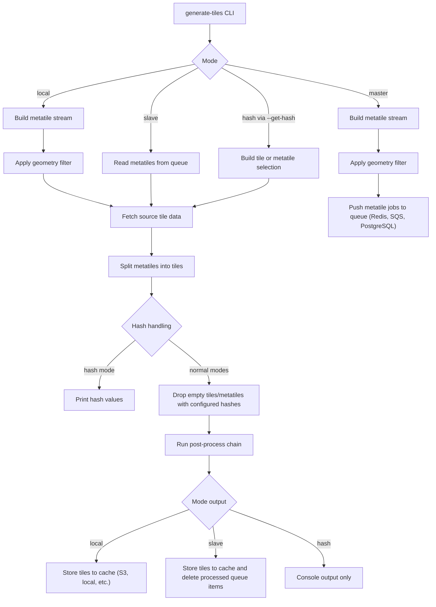

# TileCloud-chain

TileCloud Chain is a comprehensive toolset for generating, serving, and managing map tiles. It supports WMS and Mapnik sources, multiple cloud and local storage backends, distributed master/slave generation with configurable queue backends, and a built-in WMTS tile server with an administrative web interface.

## Sources

- Web Map Service (WMS)
- Mapnik rendering engine (legacy)

## Destination Formats and Storage

- Web Map Tile Service (WMTS) layout
- Amazon S3 storage
- Azure Blob storage
- Local filesystem
- SQLite (MBTiles) support (legacy)
- Berkeley DB integration (legacy)

## Key Features

- **Tile generation** in three modes: `local` (single machine), `master` (prepares jobs for a queue), `slave` (consumes jobs from the queue)
- **Distributed generation** with configurable queue backends: Redis, Amazon SQS, or PostgreSQL
- **Daemon mode** for continuous slave operation
- **Zoom separation** via `min_resolution_seed`: pre-generate low zooms, serve high zooms dynamically through the internal MapCache
- **Geometry-based filtering** using PostGIS SQL queries or GDAL datasources (e.g. Shapefile) — only generate tiles that intersect your areas of interest
- **Bounding box filtering** to restrict tile generation to a geographic extent
- **Multi-grid support**: multiple grids per layer with TileMatrixSetLimits in WMTS capabilities
- **Layer dimensions**: multi-variant tilesets (e.g. time, date) with WMTS dimension support
- **MetaTiles**: efficient generation by fetching multiple tiles in a single WMS request, with configurable size and border buffer
- **Empty tile detection** via SHA-1 hashing at both metatile and tile level
- **Tile post-processing**: run external tools (optipng, jpegoptim, pngquant) and configure Pillow save options
- **Legend image generation**: per-layer, per-zoom legend images with SHA-1 deduplication
- **WMTS GetCapabilities**: automatic XML generation with TileMatrixSetLimits, legend URLs, and ResourceURLs for GetFeatureInfo
- **GetFeatureInfo** (interrogation): WMS feature info proxy, available via REST and KVP interfaces
- **WMTS tile server**: built-in FastAPI server serving tiles via RESTful URLs and KVP interface, with caching, CORS, CSP, GZip compression, and configurable cache expiration
- **Internal MapCache**: Redis-based dynamic tile cache with locking for concurrent generation, WMS fallback for cache misses, and geometry-based redirect
- **Administration web interface**: job status monitoring, PostgreSQL job lifecycle (create/cancel/retry), command execution with ACL validation, OAuth2 GitHub authentication, and configuration validation
- **OpenLayers demo page**: interactive map with WMTS layers, dimension selectors, GetFeatureInfo on click, and state persistence in the URL
- **Multi-tenant mode**: host-based configuration resolution for serving multiple projects from a single deployment
- **Monitoring**: Prometheus metrics (`tilecloud_chain_*` counters) and Sentry error reporting
- **Empty tile detection** via hashing
- **Geographic filtering** (bbox and geometry-based)

## Legacy Support

The following features are maintained for backward compatibility:

- Mapnik rendering
- Mapnik UTFGrid (interactive tile grids)
- Berkeley DB integration
- SQLite (MBTiles) support
- Error file generation and tile retry (`--tiles`)

## Visual Preview

The admin interface with PostgreSQL queue integration:


The test page:



[Demo](https://geomapfish-demo-master.camptocamp.com/tiles/admin/test).

## Getting Started

Create a configuration file at `tilegeneration/config.yaml`.

Reference the [example configuration](https://github.com/camptocamp/tilecloud-chain/blob/master/example/tilegeneration/config.yaml).

## Commands

| Command               | Description                                                                                                                                |
| --------------------- | ------------------------------------------------------------------------------------------------------------------------------------------ |
| `generate-tiles`      | Generate tiles from WMS or Mapnik sources. Supports `local`, `master`, and `slave` roles, and `--get-hash` for computing empty tile hashes |
| `generate-controller` | Generate WMTS capabilities, legend images, display queue status, or dump the effective configuration                                       |

## Generation Pipeline

The `generate-tiles` command supports four execution modes:

- `local`: generate tiles directly and store them in the target cache.
- `master`: prepare metatile jobs and push them to the queue store.
- `slave`: read jobs from the queue store, generate tiles, and store them.
- `--get-hash`: switch to hash mode to print metatile/tile hashes.


```mermaid
flowchart TD
    A["generate-tiles CLI"] --> B{"Mode"}

    B -->|local| L1["Build metatile stream"]
    B -->|master| M1["Build metatile stream"]
    B -->|slave| S1["Read metatiles from queue"]
    B -->|hash via --get-hash| H1["Build tile or metatile selection"]

    L1 --> L2["Apply geometry filter"]
    L2 --> C["Fetch source tile data"]
    M1 --> M2["Apply geometry filter"]
    M2 --> O3["Push metatile jobs to queue (Redis, SQS, PostgreSQL)"]
    S1 --> C
    H1 --> C

    C --> D["Split metatiles into tiles"]
    D --> E{"Hash handling"}

    E -->|hash mode| H2["Print hash values"]
    E -->|normal modes| F["Drop empty tiles/metatiles with configured hashes"]

    F --> G["Run post-process chain"]
    G --> I{"Mode output"}

    I -->|local| O1["Store tiles to cache (S3, local, etc.)"]
    I -->|slave| O2["Store tiles to cache and delete processed queue items"]
    I -->|hash| O4["Console output only"]
```

## Server

TileCloud Chain includes a built-in WMTS tile server powered by FastAPI:

- **WMTS REST API**: tile serving with and without dimensions
- **KVP interface**: supports GetCapabilities, GetTile, and GetFeatureInfo via query parameters
- **Internal MapCache**: Redis-based dynamic tile cache with locking for concurrent generation and WMS fallback on cache miss
- **GetFeatureInfo**: proxies feature info requests to the configured WMS backend
- **Cache headers**: configurable `Expires` and `Cache-Control`
- **CORS**: configurable origins, methods, headers, and credentials
- **CSP**: Content Security Policy with nonce-based scripts
- **Prometheus metrics**: request counters and resource usage
- **Sentry**: error reporting integration
- **Multi-tenant**: host-based configuration resolution
- **Tile-Backend header**: reports whether a tile came from cache, Redis, or WMS generation

## Admin Interface

The web admin interface provides:

- **Job status**: per-job counters (to generate, pending, error) with PostgreSQL, or queue counters with Redis/SQS
- **PostgreSQL job management**: create, cancel, and retry jobs (retry only errored metatiles)
- **Command execution**: run `generate-tiles` and `generate-controller` with validated arguments
- **Configuration validation**: schema validation errors and deprecation warnings
- **Predefined commands**: quick-run buttons for common operations
- **OAuth2 authentication**: GitHub OAuth2 with configurable access control
- **Test page**: OpenLayers map with WMTS layers, dimension selectors, GetFeatureInfo, and URL-based state persistence

## Development

### Building

```bash
make build
```

### Quality Assurance

```bash
make prospector
```

### Testing

```bash
make tests
```

## Documentation

- [Usage Guide](https://github.com/camptocamp/tilecloud-chain/blob/master/tilecloud_chain/USAGE.rst)
- [Configuration Reference](https://github.com/camptocamp/tilecloud-chain/blob/master/tilecloud_chain/CONFIG.md)
- [Environment variables](https://github.com/camptocamp/tilecloud-chain/blob/master/tilecloud_chain/settings.py)

## Contributing

Set up pre-commit hooks:

```bash
pip install pre-commit
pre-commit install --allow-missing-config
```
